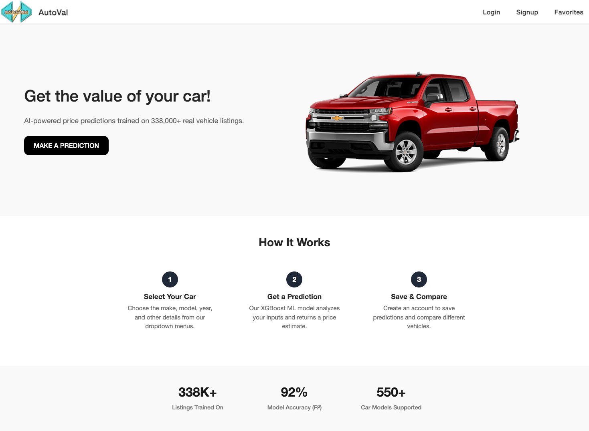
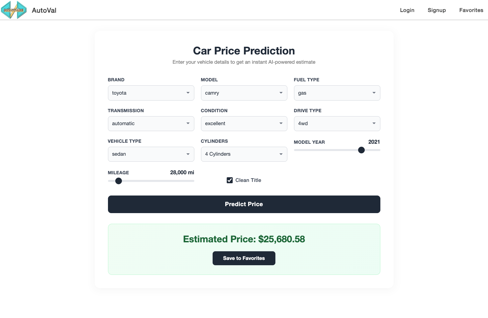
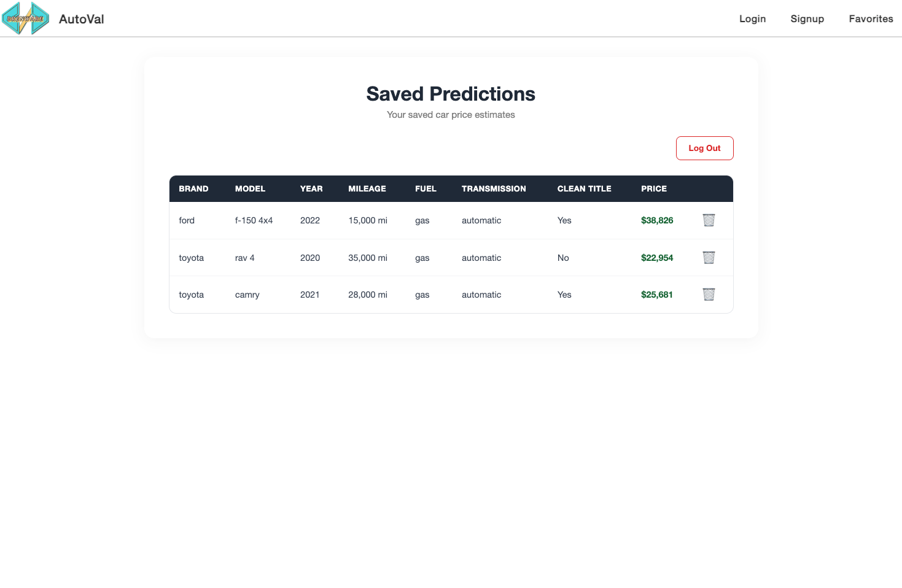

# AutoVal — AI Car Price Predictor


A full-stack machine learning web app that predicts used car prices based on make, model, year, mileage, and other vehicle attributes. Built with a **React** frontend, **Flask + XGBoost** ML backend, and **Spring Boot + PostgreSQL** authentication/favorites backend.

> Trained on **338,000+** real vehicle listings with an **R² of 0.92** and **MAE of ~$2,300**.


<div align="center">
  
</div>
<br/>
<div style="display: flex; justify-content: center; gap: 10px;">
  
  
</div>


## Architecture

```
┌─────────────┐     ┌──────────────────┐     ┌──────────────────────┐
│   React UI  │────▶│  Flask ML API    │     │  Spring Boot API     │
│  (Vite)     │     │  /predict        │     │  /auth, /favorites   │
│  Port 5173  │     │  /api/car_options │     │  JWT + Email Verify  │
└─────────────┘     │  Port 5000       │     │  Port 8080           │
                    └──────────────────┘     └──────────┬───────────┘
                    XGBoost Model (R²=0.92)             │
                                                   PostgreSQL
```

**Frontend** — React 19 + Vite + React Router + Bootstrap  
**ML Backend** — Flask + XGBoost + Pandas + scikit-learn  
**Auth Backend** — Spring Boot 3.4 + Spring Security + JWT + JPA  
**Database** — PostgreSQL (users, favorites)

---

## Features

- **ML Price Prediction** — XGBoost model trained on 338K+ Craigslist listings
- **Smart Dropdowns** — Normalized car makes/models with 550+ options
- **User Authentication** — JWT-based sign-up, login, and email verification
- **Save Predictions** — Logged-in users can save and manage favorite predictions
- **Responsive Design** — Works on desktop and mobile
- **Input Validation** — Server-side validation on all API endpoints
- **Rate Limiting** — Flask API protected with per-IP rate limits
- **Security** — CORS whitelisting, sanitized error responses, Supabase RLS enabled

---

## Getting Started

### Prerequisites

- **Node.js** 18+
- **Python** 3.10+
- **Java** 21+
- **PostgreSQL** 15+

### 1. Clone the repository

```bash
git clone https://github.com/BrendaG04/AutoVal.git
cd AutoVal
```

### 2. Frontend

```bash
cd frontend
cp .env.example .env        # configure API URLs
npm install
npm run dev                  # starts on http://localhost:5173
```

### 3. Flask ML Backend

```bash
cd backend/flask_ML
python -m venv venv
source venv/bin/activate     # Windows: venv\Scripts\activate
pip install -r requirements.txt
cp .env.example .env         # optional configuration
python app.py                # starts on http://localhost:5000
```

### 4. Spring Boot Backend

```bash
cd backend/springboot
cp .env.example .env         # fill in DB credentials, JWT secret, email config
./mvnw spring-boot:run       # starts on http://localhost:8080
```

> **Note:** Create a PostgreSQL database and update `backend/springboot/.env` with your credentials before starting.

---

## 🧠 ML Model Details

| Metric | Value |
|--------|-------|
| Algorithm | XGBoost (Gradient Boosted Trees) |
| Training Data | 338,000+ Craigslist vehicle listings |
| R² Score | 0.92 |
| Mean Absolute Error | ~$2,300 |
| Features | 32 (odometer, age, cylinders, condition, fuel, transmission, drive, type, manufacturer, model) |

The model uses target encoding for manufacturer/model, ordinal encoding for condition, and one-hot encoding for categorical features. Model names are normalized from free-text Craigslist data using a multi-layer approach (trim keyword removal, known model matching, alias consolidation).

---

## 📁 Project Structure

```
AutoVal/
├── frontend/                  # React + Vite
│   ├── src/
│   │   ├── components/
│   │   │   ├── HomePage/      # Landing page
│   │   │   ├── PredictionPage/# Prediction form
│   │   │   ├── Favorites/     # Auth & saved predictions
│   │   │   └── Header/        # Navigation
│   │   └── services/          # API service layer
│   └── .env.example
├── backend/
│   ├── flask_ML/              # Flask ML API
│   │   ├── app.py             # Flask routes (/predict, /api/car_options)
│   │   ├── model/             # Trained model artifacts
│   │   │   ├── car_price_predictor.pkl
│   │   │   └── car_price_model.json
│   │   ├── scripts/
│   │   │   └── retrain_model.py   # Model training pipeline
│   │   ├── tests/
│   │   │   └── test_app.py        # API tests (7 tests)
│   │   └── requirements.txt
│   └── springboot/            # Spring Boot Auth API
│       ├── src/main/java/com/carprice/backend/
│       │   ├── controllers/   # REST controllers
│       │   ├── dto/           # Request DTOs with validation
│       │   ├── favorites/     # Favorites CRUD
│       │   ├── model/         # User entity
│       │   └── service/       # Auth, JWT, Email services
│       ├── src/test/java/     # Controller tests (11 tests)
│       └── .env.example
└── README.md
```

---

## 🛠️ Tech Stack

| Layer | Technology |
|-------|-----------|
| Frontend | React 19, Vite 6, React Router 7, Bootstrap 5, Axios |
| ML Backend | Python 3, Flask 3, XGBoost 2.1, Pandas, scikit-learn, Flask-Limiter |
| Auth Backend | Java 21, Spring Boot 3.4, Spring Security, JPA, Lombok |
| Database | PostgreSQL 15 |
| Auth | JWT (jjwt), Email verification |

---

## 📝 License

This project is for educational purposes.

---

Built by [Brenda G.](https://github.com/BrendaG04)
